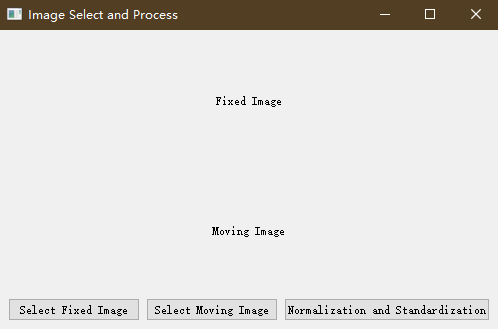
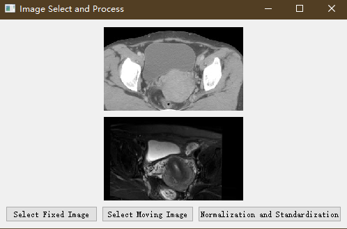
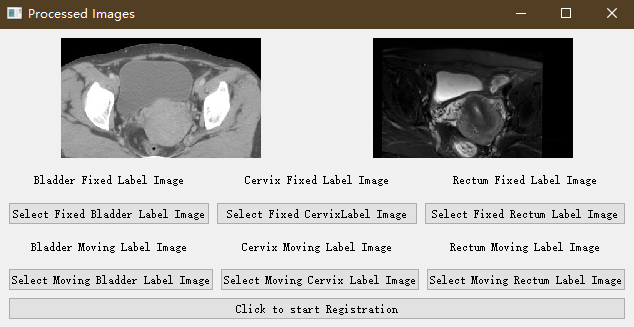
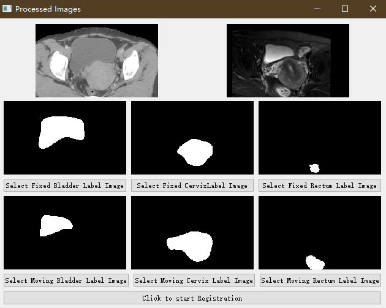
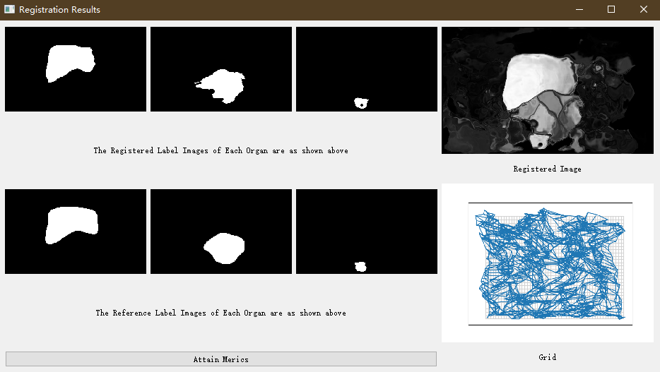
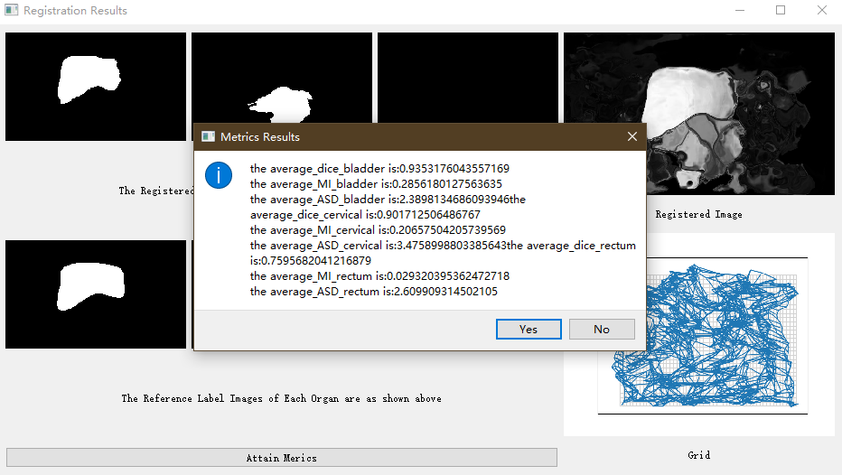

---

# Cross-Modal Multi-Organ Registration System

## Project Introduction
This is a cross-modal registration system for multi-organ images, supporting registration across different modalities such as MRI and CT. The system is developed in Python, with the user interface built using PyQt5 and deep learning algorithms implemented using PyTorch.

## Functions
1. **Image Preprocessing**: Normalizes and standardizes uploaded images and processes uploaded labels.
2. **Multi-Organ Registration**: Performs registration for multiple organs, outputs the registered images, and generates deformation fields.
3. **Result Evaluation**: Compares label images before and after registration against the reference image, and provides evaluation metrics such as Dice, Mutual Information (MI), and Average Symmetric Surface Distance (ASD).


## System Requirements
- **Python**: Version 3.7 or higher
- **Dependencies**:
  - PyQt5
  - PyTorch
  - NumPy
  - SciPy
  - OpenCV
  - SimpleITK (for medical image processing)
- **Operating System**: Windows / macOS / Linux

## Installation and Running
1. **Run the System**:
   ```bash
   python RegisterSystem.py
   ```

## Usage
1. **Start the Program**: Running `RegisterSystem.py` will launch the graphical user interface.
2. **Upload Images**: Use the interface to upload the images and labels for registration. (You can use the images in ./example)
3. **Select Registration Parameters**: Choose the registration algorithm and parameters as needed.
4. **Begin Registration**: Click the "Click to start Registration" button to begin the registration process.
5. **View Results**: After registration, the system will display the registered images, deformation fields, and evaluation metrics.


## Representation












## License
This project is licensed under the [MIT License](LICENSE).

---
